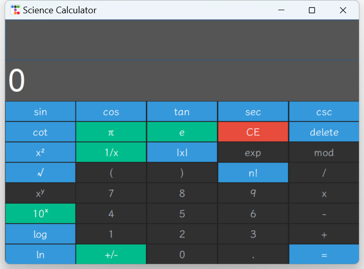
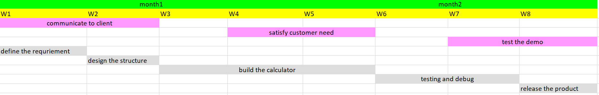

## Graphical of the project

## the type of software development process

> In this project, we use the agile development process, the following reason will explain why we choose this method. The first reason is agile development is more flexible for develop. It is not necessary to follow the strict process, we can change the process according to the actual situation. In the current rapidly changing market, the agile development process can adapt to the market changes more quickly. The second reason is agile development is more suitable for the project with a short development cycle. for our project, we only have four team member and a month to implement the project, so we need to choose a development process that can be completed in a short time.

## software process

> in our development process, in the first place, we need to consider the requirement of the software. In this case , we analyze the advantage and disadvantage of the product that existing the market. also collect the market need from the user. After that ,we need to consider what content build in our project.According to the research of the market , we can find out the shortcomings of mainstream products and Improve these deficiencies. It can help our team to determine the key features and function of the project. In the next step, we need to design the components of the project. such as the button style, the reaction of the button, the user input entry and answer entry etc. In the next step, we need to implement the project. in this section, we built test mockups for the product, which allowed us to debug quickly during the development phase. finally,. we need to test the project in different operating system and different input method. in addition to ensure our project can run smoothly.

## Member (Roles & Responsibilities & Portion)

> - Bosco(P2104174) focus testing and controller of the software
> - Tim(P2104193) focus the model and controller of the software
> - Jacky(P2104352) focus readme and testing of the software
> - Benjamin(P2104459) focus the user interface and readme of the software

## algorithm

> before we design and implement our project,In the first time ,we have researched the market about our project, then we analysis the risk of the project and identify the main challenge in our project. So than we can predict what the market need and how many time we need development the product. In our project demo, we implement most of the function of the calculator, such as Trigonometric function , Arithmetic , factorial , etc. when we design the calculator, we adapt the MVC pattern . It mean that we can easily to switch our user interface or the calculator function according to the market need. After we build the first version for our project, we can do the testing to ensure the project satisfy the requirement of the market. So that we can keep up with the changes in the market in time.

## shedule

## future plan

> At this stage, we have finished the basic function of the calculator,such as arithmetic, log, trigonometric function and so on. We will add more function in the future, such as matrix , calculus and so on. in addition, we also intend to add some auxiliary tools , for example, the record function for user to record the calculation process, the help function for user to get the help information and so on. In future , we consider to develop a function that let user write a script by themselves and then the calculator can run it step by step to get the result, which is similar to the function of the matlab.

## additional component

> we use python to build the project. The python version used for development is 3.10.6 , the software needs to run in a python 3 environment. Our IDE is vscode, base on the tkinter and ttkbootstrap library , the project implement the cross-platform running, so most mainstream operating systems can run the project smoothly , such as windows, linux, macos and so on. the following operating system has been tested and can run the project : Windows 11 , Windows 10 , Windows 7 , Ubuntu 22.04 , Ubuntu 20.04, Linux Mint 21 , Linux Mint 20.

## demo

> the following link is the demo video of the project: https://youtu.be/E4v4kf-UrqY 
